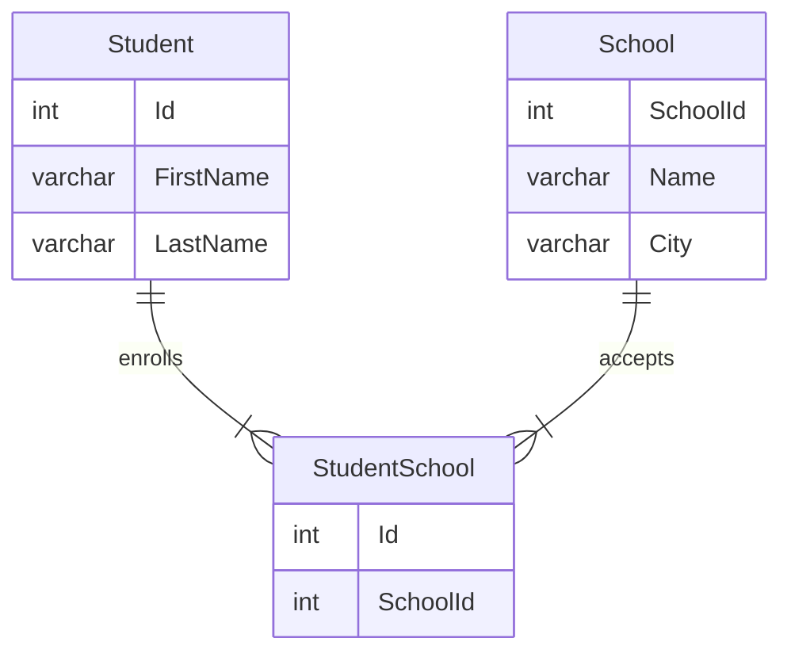

# db2022-mermaid

## Entity Relationship Diagram

```mermaid
erDiagram
        
Student ||--|{ StudentSchool : enrolls
School ||--|{ StudentSchool : accepts


    StudentSchool {
        int Id
        int SchoolId
    }
    
    Student {
        int Id
        varchar FirstName
        varchar LastName
    }
    
    School {
        int SchoolId
        varchar Name
        varchar City
    }
    
```
