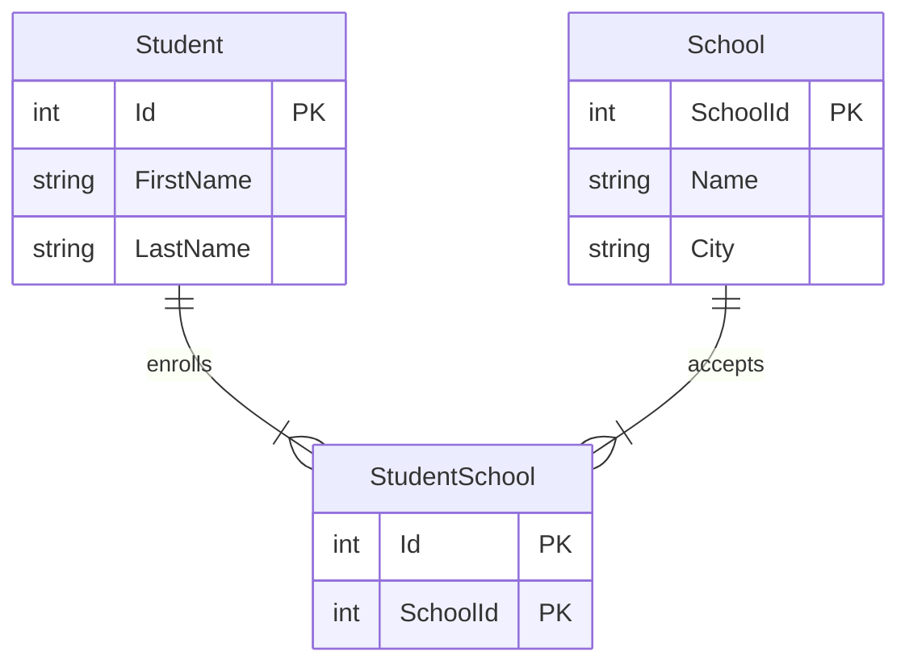

# db2022-mermaid

## Beskrivning
I kursen DB2022 på IT-Högskolan skulle vi redovisa på färdigheter i SQL, Normalisering samt Java mot en relationsdatabas. Detta är min redovisning av ett E-R Diagram.

Mermaid som jag använt är ett verktyg för att rita diagram i Markdown. Istället för exemplevis Lucidchart, valde vi Mermaid, för att få grafen kodnära.

## Entity Relationship Diagram

